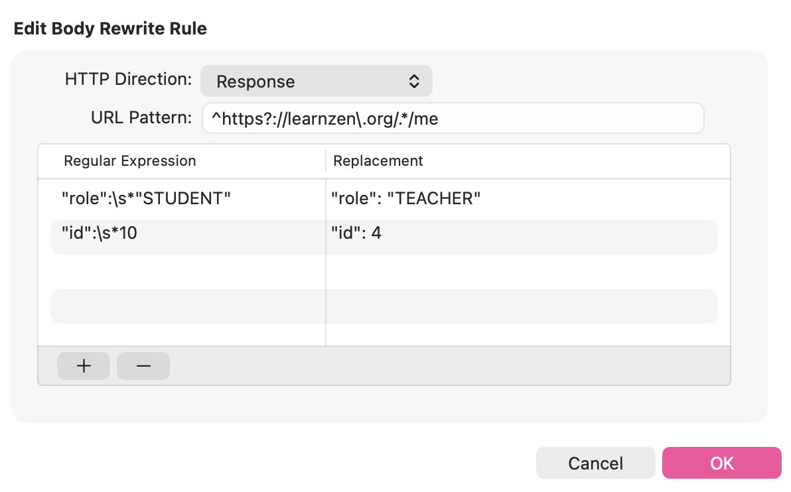
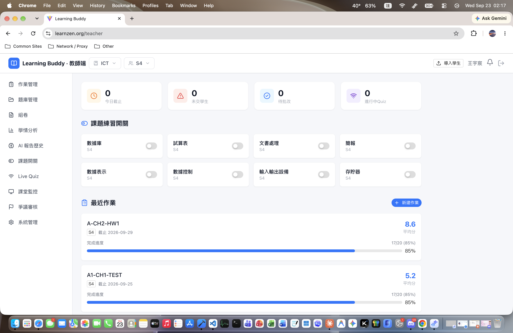
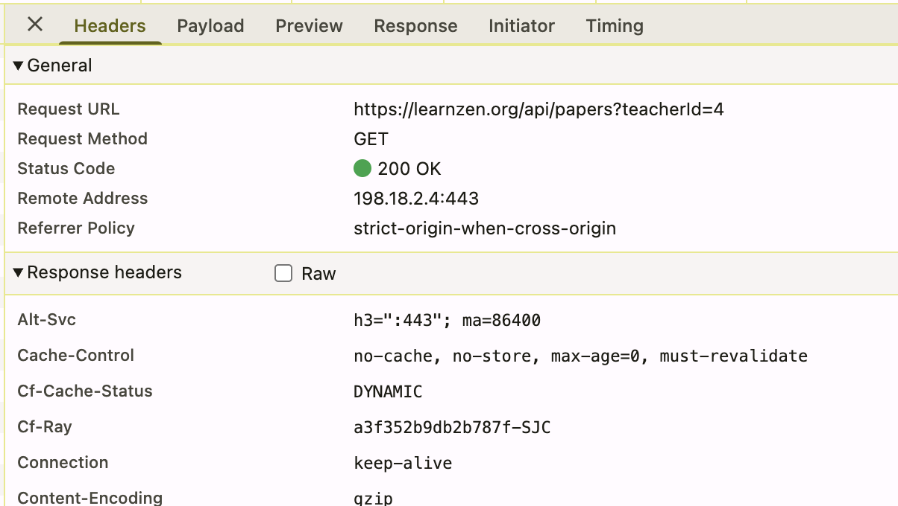
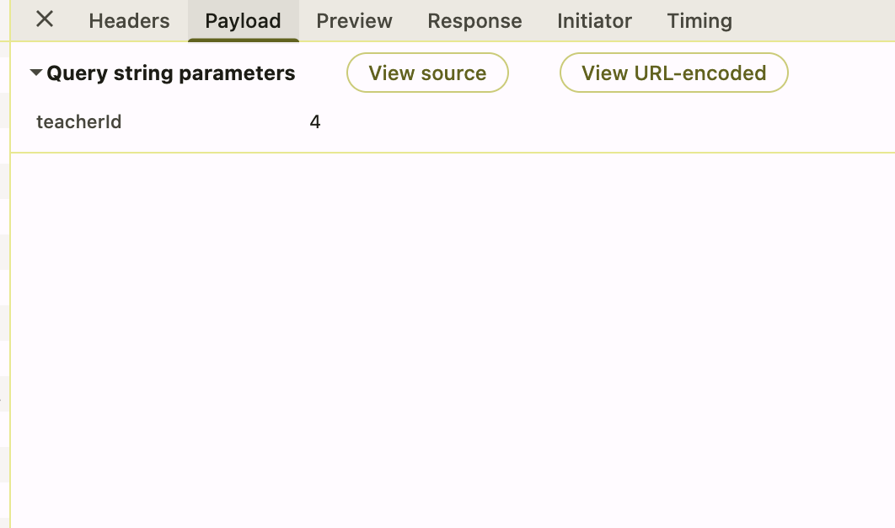

# LearnZen 權限控制失效漏洞

## 摘要

- LearnZen 的 login API 會回 `id` 和 `role` 
- 前端在**沒有驗證過**的情況直接用這組值判斷角色 又把這些值帶進後續的後端 API 請求
- 攻擊者只要竄改 login 的**回應** 就可以讓前端以為自己是老師，並把偽造的 `id` / `role` 轉發給其他後端 API..而後端也信任這組客戶端送來的值 於是完成越權操作

- **漏洞類型：** Broken Access Control（權限控制失效），含 IDOR
- **成因：** 前端無條件信任 login 回應中的身份欄位

> 重點：後端**不能信任**客戶端送來的 `id` / `role`*****

## 重現步驟

### 1. 竄改 login API 回應中的身份欄位

- 用學生帳號登入，login API 回傳 `{ id: 10, role: "STUDENT" }`
- 把回傳的值送到 前端 之前竄改為：

    - `role`：`"STUDENT"` → `"TEACHER"`
    - `id`：`10` → `4`
    - （由 `/api/assignments/student` 的回應得知目標 `teacherId` 為 `4`）

### 2. 前端被偽造的值欺騙，導向老師頁面

- 前端直接用了回傳值中的 `role` 判斷角色
- 登入後將使用者導向 `/teacher`
- 並把偽造的 `id:4` / `role:"TEACHER"` 保存在前端。

### 3. 前端把被欺騙的身份又發給其他後端 API，後端相信了並執行漏洞

- 執行管理員操作時 前端把保存的 `role:"TEACHER"` / `id:4` 帶進**其他後端 API** 的請求
- 後端直接相信這是老師的請求，回 `HTTP 200 OK` 並實際完成該操作。

---

## 影響

- 學生可取得老師權限
- 可指定任意 `id` 存取或操作他人資源
- 攻擊者幾乎可執行任何管理員層操作（讀取、修改等）